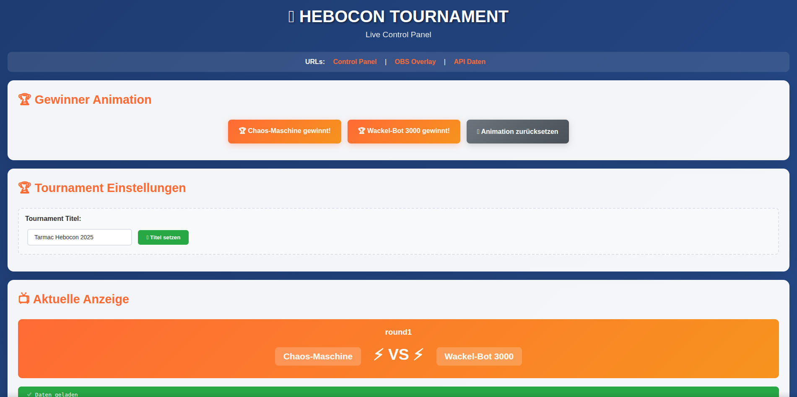
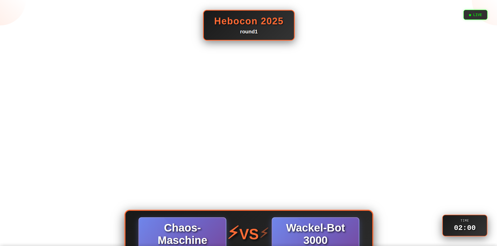
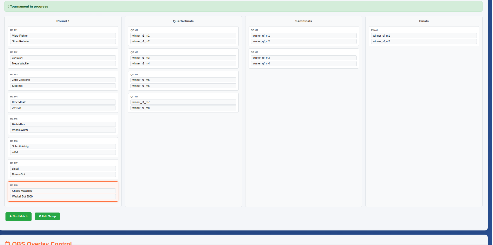
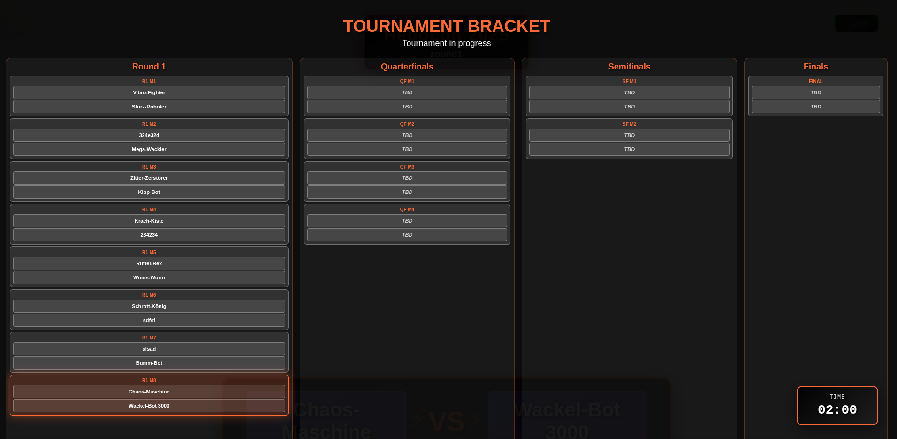
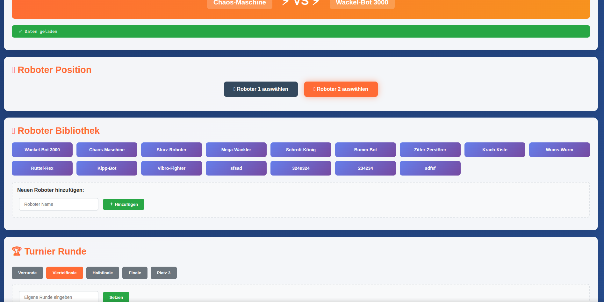
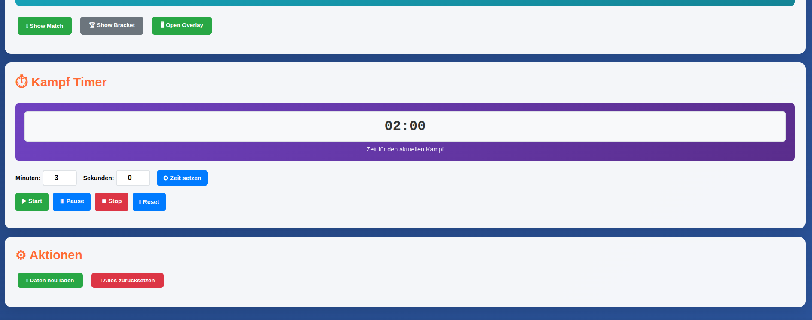
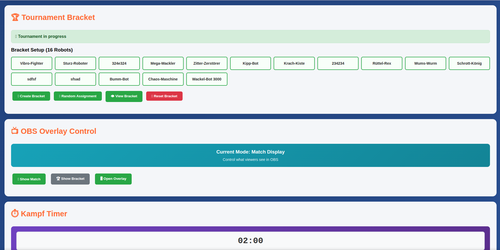

# Hebocon Tournament Server

A Python Flask web application for managing and live-streaming robot tournament displays. This system provides a complete solution for tournament management with a live control panel and OBS streaming overlay.

## 🚀 Features

- 🎮 **Live Control Panel** for tournament management
- 📺 **OBS Streaming Overlay** for viewers
- 🏆 **16-Player Bracket System** with automatic management
- ⏱️ **Battle Timer** with visual status indicators
- 🤖 **Robot Library** with dynamic management
- 📊 **Real-time data transmission** between all components

## 📋 Quick Start

### System Requirements
- Python 3.7+
- Flask 2.3.3+
- Werkzeug 2.3.7+

### Installation

```bash
# Clone the repository
git clone <repository-url>
cd hebocon-tournament

# Create virtual environment
python3 -m venv venv
source venv/bin/activate

# Install dependencies
pip install -r requirements.txt

# Start the server
python3 app.py
```

### Access Points
After starting, the system is available at:

- **Control Panel**: `http://localhost:5005/`
- **OBS Overlay**: `http://localhost:5005/overlay`
- **API Data**: `http://localhost:5005/api/data`

## 📸 Screenshots

| Control Panel | OBS Overlay |
|---------------|-------------|
|  |  |
|  |  |
|  |  |
|  | |

## 🎛️ Control Panel Features

### Match Management
- **Current Match Display**: Shows active battle with visual indicators
- **Robot Slot Selection**: Choose robots for positions 1 and 2
- **Robot Library**: Grid layout with all available robots
- **Quick Add**: Input field for adding new robots instantly

### Tournament Bracket System
- **Create Bracket**: Initialize empty 16-participant bracket
- **Random Assignment**: Automatically distribute robots to positions
- **Live Tournament**: Visual bracket with match dependencies
- **Match Navigation**: Next match progression and setup editing

### Battle Timer
- **Configurable Duration**: Separate minute/second inputs
- **Timer Controls**: Start, Pause, Stop, Reset buttons
- **Visual Display**: Large MM:SS format with gradient background
- **Status Animations**: Color-coded states (running, warning, critical)

### Overlay Control
- **Display Modes**: Switch between Match and Bracket views
- **Live Status**: Real-time synchronization indicators
- **OBS Integration**: Direct overlay link for streaming

### Keyboard Shortcuts
- `1` / `2`: Select robot slots
- `F5`: Refresh data
- `Enter`: Submit in input fields

## 📺 OBS Overlay Features

### Match Display Mode
- **Tournament Header**: Title with gradient and glow effects
- **VS Display**: Large robot name boxes with central VS animation
- **Visual Effects**: Corner decorations, shine animations, pulse effects
- **Timer Display**: Consistent MM:SS format with status colors

### Bracket Display Mode
- **Full-Screen Bracket**: 4-column grid layout
- **Live Status Updates**: Real-time match progression
- **Match Visualization**: Color-coded status (pending, active, completed)
- **Interactive Elements**: Compact match IDs and participant display

### Universal Elements
- **Live Indicator**: Green pulsing "LIVE" status
- **Timer Display**: Fixed position with status animations
- **Error Handling**: Automatic recovery and connection monitoring

## 🔧 API Documentation

### Core Endpoints

#### `GET /api/data`
Retrieve complete tournament data:
```json
{
  "robots": ["Robot1", "Robot2", ...],
  "current_match": {
    "robot1": "Wackel-Bot 3000",
    "robot2": "Chaos-Maschine", 
    "round": "Quarterfinals"
  },
  "bracket": { ... },
  "overlay_settings": {
    "display_mode": "match"
  },
  "timer": { ... },
  "last_updated": "2025-08-20T00:33:45.240346"
}
```

#### `GET/POST /api/robots`
- **GET**: List all robots
- **POST**: Add new robot
```json
POST: {"name": "New Robot"}
Response: {"success": true, "message": "Robot added"}
```

#### `GET/POST /api/match`
- **GET**: Get current match
- **POST**: Update match parameters
```json
POST: {
  "robot1": "Robot Name",
  "robot2": "Other Robot",
  "round": "Finals"
}
```

### Bracket Management

#### `POST /api/bracket/setup`
Create tournament bracket:
```json
{
  "robots": ["Robot1", "Robot2", ...],
  "random": true
}
```

#### `POST /api/bracket/match/<match_id>`
Set match winner:
```json
POST: {"winner": "Robot Name"}
Response: {"success": true, "bracket": {...}}
```

#### `POST /api/bracket/match/<match_id>/undo`
Undo match result

### Timer API

#### `GET/POST /api/timer`
- **GET**: Current timer status
- **POST**: Execute timer action
```json
POST: {
  "action": "start|stop|pause|reset",
  "duration": 180
}
```

### Overlay Control

#### `GET/POST /api/overlay/mode`
OBS overlay display mode:
```json
POST: {"mode": "match|bracket"}
GET Response: {"mode": "match"}
```

## 🎥 OBS Studio Integration

### Scene Setup
1. **Add Source** → "Browser Source"
2. **URL**: `http://<server-ip>:5005/overlay`
3. **Width**: 1920, **Height**: 1080
4. **FPS**: 30, **CSS**: Not required
5. **Shutdown source when not visible**: Enabled
6. **Refresh browser when scene becomes active**: Recommended

### Streaming Quality
- Fully transparent background
- High-contrast colors for all streaming qualities
- Optimized for both light and dark backgrounds
- 60fps-compatible animations

## 🏗️ Architecture

### Core Components
- **app.py**: Flask server with REST API endpoints
- **tournament_data.json**: Persistent storage for tournament state
- **templates/control.html**: Interactive control panel
- **templates/overlay.html**: Broadcast overlay for OBS

### Data Flow
1. Control panel sends updates via REST API to Flask server
2. Server persists data in tournament_data.json
3. Overlay polls /api/data every 1-2 seconds for live updates
4. All changes are immediately reflected in the broadcast overlay

## 🔧 Troubleshooting

### Common Issues

#### "No connection to server"
- **Cause**: Flask server not started or port blocked
- **Solution**: Run `python3 app.py`, check port 5005

#### "Tournament bracket not set up"
- **Cause**: Bracket not initialized
- **Solution**: Click "Create Bracket" in control panel

#### Timer not syncing
- **Cause**: Client-server time drift
- **Solution**: Reload overlay, synchronize system time

#### Robots not appearing in overlay
- **Cause**: Match not set or wrong display mode
- **Solution**: Assign robots to slots, check display mode

### Debug Information
- **Console Logging**: F12 → Console for detailed logs
- **API Testing**: Access `/api/data` directly in browser
- **Status Monitoring**: Status indicators in control panel & overlay

## 🎯 About Hebocon

Hebocon is a robot sumo competition for those who are not technically gifted. Robots must be cheap, homemade, and somewhat broken or malfunctioning. This tournament server provides the infrastructure to manage and broadcast these wonderfully chaotic competitions.

## 📄 License

Open source project for the robot sports community.

### Technologies Used
- **Backend**: Python 3, Flask 2.3.3, Werkzeug 2.3.7
- **Frontend**: HTML5, CSS3, Vanilla JavaScript
- **Storage**: JSON-based persistence
- **Real-time**: RESTful API with polling

## 🤝 Contributing

Pull requests and issues are welcome on GitHub.

---

*Documentation for Hebocon Tournament Server v1.0*  
*Last updated: August 2025*